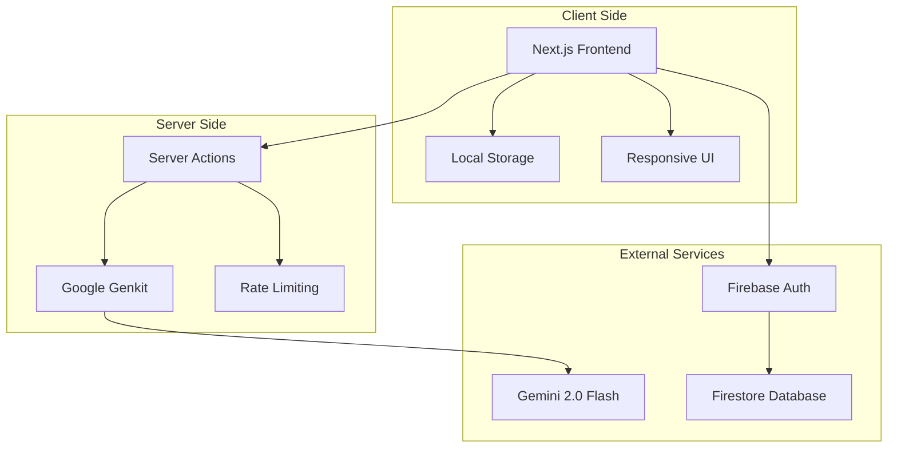

# MarketPlanAI 🚀

> **Intelligent Marketing Plan Builder** - Create comprehensive marketing strategies with AI-powered assistance

[](https://github.com/your-org/marketplan-ai/actions)
[](LICENSE)
[](https://github.com/your-org/marketplan-ai/releases)
[](https://marketplan-ai.com)

MarketPlanAI is a comprehensive, AI-powered marketing plan builder that guides businesses through creating professional marketing strategies using expert frameworks and intelligent suggestions. Transform your business ideas into actionable marketing plans in minutes, not weeks.

## ✨ Features

### 🎯 **Comprehensive Planning Framework**
- **6-Step Marketing Process** based on "The Marketing Plan Handbook"
- **SWOT Analysis** with competitor intelligence
- **Customer Persona Development** with detailed segmentation
- **STP Strategy** (Segmentation, Targeting, Positioning)
- **Marketing Mix (4 Ps)** planning framework
- **AIDA Copywriting** framework integration

### 🤖 **AI-Powered Intelligence**
- **Google Gemini 2.0 Flash** integration for smart suggestions
- **Industry-specific recommendations** based on business description
- **Automated content generation** for all planning sections
- **Intelligent competitor analysis** and market insights
- **Professional copywriting** assistance

### 💼 **Professional Tools**
- **Real-time auto-save** with local data persistence
- **Export capabilities** (Copy, Print, PDF-ready)
- **Responsive design** for desktop, tablet, and mobile
- **Progress tracking** with completion indicators
- **Professional formatting** ready for presentation

### 🔒 **Security & Privacy**
- **Local-first data storage** for maximum privacy
- **No account required** for basic functionality
- **GDPR compliant** data handling
- **Enterprise-grade security** measures

---

## 🛠️ Tech Stack

### Frontend
- **[Next.js 15.3.3](https://nextjs.org/)** - React framework with App Router
- **[TypeScript](https://www.typescriptlang.org/)** - Type-safe development
- **[Tailwind CSS](https://tailwindcss.com/)** - Utility-first styling
- **[Radix UI](https://www.radix-ui.com/)** - Accessible component primitives
- **[shadcn/ui](https://ui.shadcn.com/)** - Modern UI component library

### AI & Backend
- **[Google Genkit](https://firebase.google.com/docs/genkit)** - AI development framework
- **[Gemini 2.0 Flash](https://deepmind.google/technologies/gemini/)** - Advanced AI model
- **[Next.js Server Actions](https://nextjs.org/docs/app/building-your-application/data-fetching/server-actions)** - Server-side logic

### Infrastructure
- **[Firebase App Hosting](https://firebase.google.com/docs/app-hosting)** - Scalable hosting platform
- **[Firebase Firestore](https://firebase.google.com/docs/firestore)** - NoSQL database (prepared)
- **[Firebase Auth](https://firebase.google.com/docs/auth)** - Authentication service (prepared)

---

## 🚀 Quick Start

### Prerequisites

```bash
Node.js >= 18.0.0
npm >= 9.0.0
Git >= 2.30.0
```

### Installation

1. **Clone the repository**
   ```bash
   git clone https://github.com/your-org/marketplan-ai.git
   cd marketplan-ai
   ```

2. **Install dependencies**
   ```bash
   npm install
   ```

3. **Set up environment variables**
   ```bash
   cp .env.example .env.local
   # Edit .env.local with your API keys
   ```

4. **Start development server**
   ```bash
   npm run dev
   ```

5. **Open in browser**
   ```
   http://localhost:9002
   ```

### Environment Variables

```bash
# Required for AI features
GOOGLE_AI_API_KEY=your_gemini_api_key

# Firebase configuration (for future features)
NEXT_PUBLIC_FIREBASE_API_KEY=your_firebase_api_key
NEXT_PUBLIC_FIREBASE_AUTH_DOMAIN=your-project.firebaseapp.com
NEXT_PUBLIC_FIREBASE_PROJECT_ID=your-project-id

# Optional: Analytics and monitoring
SENTRY_DSN=your_sentry_dsn
GA_TRACKING_ID=your_google_analytics_id
```

---

## 📖 Usage

### Creating Your First Marketing Plan

1. **Describe Your Business**
   ```
   Enter a detailed description of your business, including:
   - Industry and business model
   - Target customers
   - Products or services
   - Unique value proposition
   - Current goals and challenges
   ```

2. **Generate AI Suggestions**
   - Click "Generate AI Suggestions" for intelligent recommendations
   - AI analyzes your business and provides relevant content for all sections

3. **Complete the 6-Step Process**
   - **Step 1:** Situation Analysis (SWOT + Competitors)
   - **Step 2:** Markets & Customers (Targeting + Personas)
   - **Step 3:** STP Strategy (Segmentation, Targeting, Positioning)
   - **Step 4:** Direction & Objectives (Mission, Vision, Goals)
   - **Step 5:** Strategies & Programs (4 Ps + AIDA Copy)
   - **Step 6:** Metrics & Control (KPIs + Monitoring)

4. **Export Your Plan**
   - Copy to clipboard for external documents
   - Print or save as PDF
   - Share sections with team members

### Example Business Description

```
"EcoBlend Coffee is a sustainable coffee roastery in Portland, Oregon, 
specializing in organic, fair-trade beans sourced directly from farmers. 
We serve environmentally conscious coffee enthusiasts aged 25-45 through 
our online store and local partnerships with cafes. Our mission is to 
provide exceptional coffee while supporting sustainable farming practices. 
We're looking to expand our customer base and increase online sales by 50% 
in the next year."
```

---

## 📚 Documentation

### For Users
- **[User Manual](./user_manual.md)** - Complete user guide and tutorials
- **[Live Demo](https://marketplan-ai.com)** - Try the application

### For Developers
- **[Technical Specification](./technical_specification.md)** - Implementation details
- **[API Documentation](./api_documentation.md)** - API reference and examples
- **[Development Workflow](./development_workflow.md)** - Development processes
- **[Testing Strategy](./testing_strategy.md)** - Testing approach and guidelines

### For DevOps
- **[Deployment Guide](./deployment_guide.md)** - Production deployment procedures
- **[Security Documentation](./security_documentation.md)** - Security policies and procedures
- **[Operations Manual](./operations_manual.md)** - System operations and monitoring

### For Product Managers
- **[Product Requirements](./product_requirements_document.md)** - Features and requirements
- **[Architecture Overview](./architectural_document.md)** - System architecture

---

## 🏗️ Architecture



---

## 🧪 Development

### Available Scripts

```bash
# Development
npm run dev              # Start development server with Turbopack
npm run genkit:dev       # Start Genkit AI development server
npm run genkit:watch     # Watch mode for AI development

# Building
npm run build            # Production build
npm run start            # Start production server
npm run analyze          # Analyze bundle size

# Quality Assurance
npm run lint             # Run ESLint
npm run typecheck        # TypeScript type checking
npm run test             # Run unit tests
npm run test:watch       # Run tests in watch mode
npm run test:coverage    # Generate coverage report
npm run e2e              # Run end-to-end tests

# Deployment
npm run deploy:staging   # Deploy to staging
npm run deploy:prod      # Deploy to production
```

### Project Structure

```
marketplan-ai/
├── src/
│   ├── app/                    # Next.js App Router pages
│   ├── components/             # React components
│   │   ├── ui/                # Base UI components (shadcn/ui)
│   │   ├── steps/             # Marketing plan step components
│   │   └── *.tsx              # Feature components
│   ├── ai/                     # AI integration
│   │   ├── flows/             # Genkit AI flows
│   │   └── genkit.ts          # AI configuration
│   ├── hooks/                  # Custom React hooks
│   ├── lib/                    # Utility libraries
│   └── types/                  # TypeScript type definitions
├── docs/                       # Documentation
├── __tests__/                  # Test files
├── cypress/                    # E2E tests
└── public/                     # Static assets
```

### Contributing

We welcome contributions! Please read our [Contributing Guidelines](CONTRIBUTING.md) for details on:

- Code of conduct
- Development setup
- Pull request process
- Coding standards
- Testing requirements

---

## 🧪 Testing

### Test Coverage
- **Unit Tests:** Jest + React Testing Library
- **Integration Tests:** API and component integration
- **E2E Tests:** Cypress for user workflows
- **Accessibility Tests:** axe-core integration
- **Performance Tests:** Lighthouse CI

### Running Tests

```bash
# Unit tests
npm run test                    # Run all tests
npm run test:watch             # Watch mode
npm run test:coverage          # With coverage report

# E2E tests
npm run e2e                    # Run Cypress tests
npm run e2e:open               # Open Cypress GUI

# Performance tests
npm run lighthouse             # Performance audit
```

---

## 🚀 Deployment

### Staging Environment
- **URL:** https://marketplan-ai-staging.web.app
- **Purpose:** Testing and QA validation
- **Auto-deployment:** On `develop` branch push

### Production Environment
- **URL:** https://marketplan-ai.com
- **Purpose:** Live application
- **Deployment:** Manual approval required

### Deployment Process

```bash
# Deploy to staging
git push origin develop

# Deploy to production
git push origin main  # After PR approval
```

For detailed deployment instructions, see our [Deployment Guide](./deployment_guide.md).

---

## 📊 Performance

### Core Web Vitals
- **First Contentful Paint (FCP):** < 1.5s
- **Largest Contentful Paint (LCP):** < 2.5s
- **Cumulative Layout Shift (CLS):** < 0.1
- **First Input Delay (FID):** < 100ms

### AI Performance
- **Generation Time:** < 30 seconds for complete plans
- **Rate Limiting:** 10 generations per hour per IP
- **Success Rate:** > 95% for valid inputs

---

## 🔐 Security

### Security Features
- **Input Validation:** Comprehensive sanitization and validation
- **XSS Protection:** Content Security Policy and output encoding
- **CSRF Protection:** Token-based protection for state changes
- **Rate Limiting:** API abuse prevention
- **Data Encryption:** At rest and in transit
- **Privacy by Design:** Local-first data storage

### Security Policies
- Regular security audits
- Vulnerability scanning
- Incident response procedures
- GDPR compliance
- SOC 2 Type II controls

For detailed security information, see our [Security Documentation](./security_documentation.md).

---

## 🌐 Browser Support

| Browser | Version | Status |
|---------|---------|--------|
| Chrome | 90+ | ✅ Fully Supported |
| Firefox | 88+ | ✅ Fully Supported |
| Safari | 14+ | ✅ Fully Supported |
| Edge | 90+ | ✅ Fully Supported |
| IE | 11 | ❌ Not Supported |

---

## 📈 Roadmap

### Version 1.1 (Q1 2025)
- [ ] User authentication and accounts
- [ ] Cloud storage and sync
- [ ] Plan sharing and collaboration
- [ ] Enhanced AI capabilities
- [ ] Mobile app development

### Version 1.2 (Q2 2025)
- [ ] Team collaboration features
- [ ] Advanced analytics and reporting
- [ ] Integration with CRM systems
- [ ] White-label solutions
- [ ] API access for developers

### Version 2.0 (Q3 2025)
- [ ] Multi-language support
- [ ] Industry-specific templates
- [ ] Advanced AI coaching
- [ ] Enterprise features
- [ ] Market intelligence integration

---

## 🤝 Support

### Getting Help
- **Documentation:** [User Manual](./user_manual.md)
- **API Reference:** [API Documentation](./api_documentation.md)
- **Issues:** [GitHub Issues](https://github.com/your-org/marketplan-ai/issues)
- **Discussions:** [GitHub Discussions](https://github.com/your-org/marketplan-ai/discussions)

### Commercial Support
For enterprise support, custom development, or consulting services, contact us at [enterprise@marketplan-ai.com](mailto:enterprise@marketplan-ai.com).

---

## 📄 License

This project is licensed under the MIT License - see the [LICENSE](LICENSE) file for details.

---

## 🙏 Acknowledgments

- **[Firebase](https://firebase.google.com/)** for the excellent platform and tooling
- **[Google AI](https://ai.google/)** for the powerful Gemini models
- **[Vercel](https://vercel.com/)** for Next.js and development tools
- **[Radix UI](https://www.radix-ui.com/)** for accessible component primitives
- **[shadcn](https://ui.shadcn.com/)** for the beautiful UI component library

---

## 📞 Contact

- **Website:** [https://marketplan-ai.com](https://marketplan-ai.com)
- **Email:** [hello@marketplan-ai.com](mailto:hello@marketplan-ai.com)
- **Twitter:** [@MarketPlanAI](https://twitter.com/MarketPlanAI)
- **LinkedIn:** [MarketPlan AI](https://linkedin.com/company/marketplan-ai)

---

<div align="center">

**Built with ❤️ for businesses who want to grow smarter, not harder.**

[Get Started](https://marketplan-ai.com) | [Documentation](./user_manual.md) | [API](./api_documentation.md) | [Support](https://github.com/your-org/marketplan-ai/issues)

</div>
