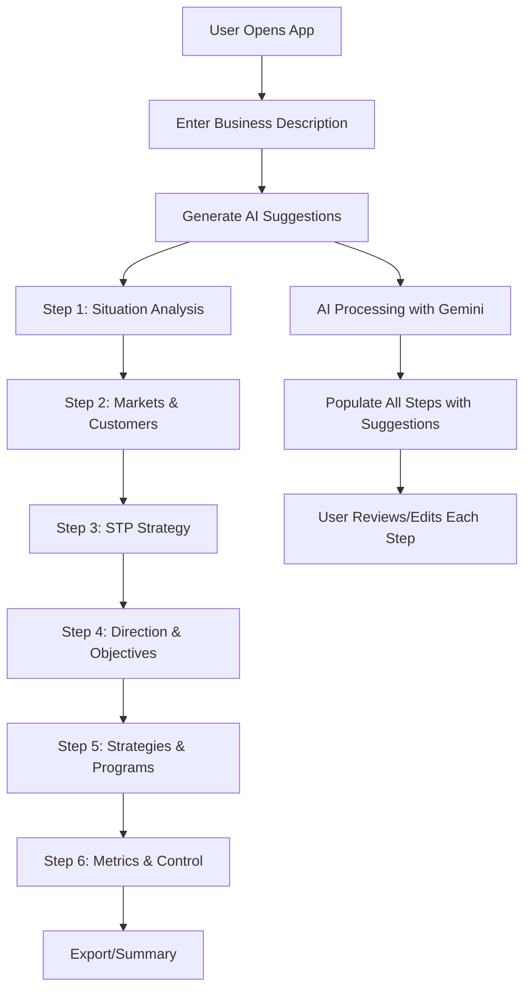
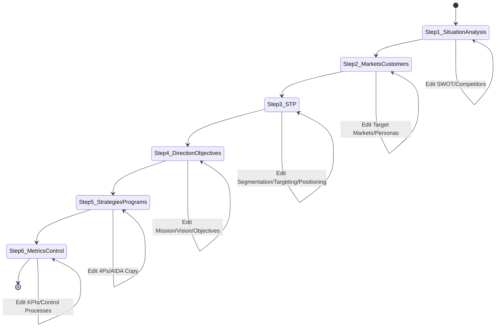
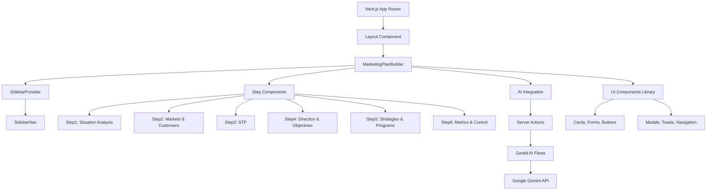
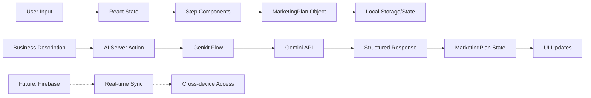
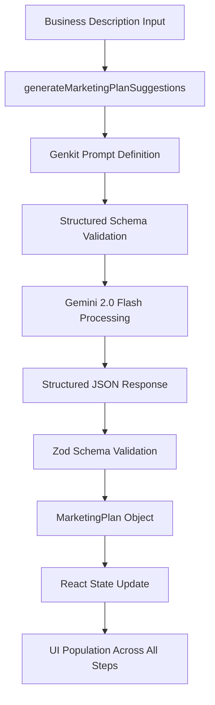
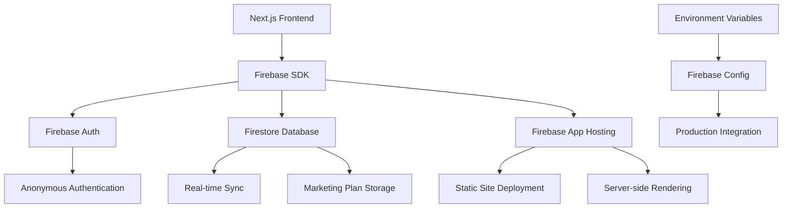
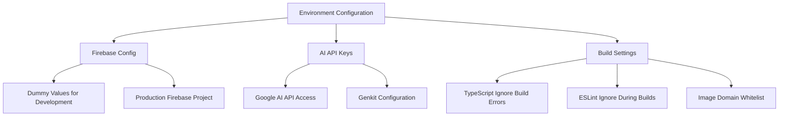

# MarketPlanAI - Architectural Document

## 1. High-Level Application Overview and Purpose

**MarketPlanAI** is an intelligent marketing plan builder application that guides users through a comprehensive 6-step marketing plan creation process. The application leverages AI-powered suggestions using Google's Gemini 2.0 Flash model to provide expert marketing consultant guidance throughout the planning process.

### Core Purpose
- **Guided Plan Creation**: Step-by-step marketing plan development based on "The Marketing Plan Handbook"
- **AI-Powered Consulting**: Real-time AI suggestions acting as a virtual marketing consultant
- **Professional Planning Tool**: Comprehensive marketing strategy development for businesses of all sizes
- **User-Friendly Interface**: Modern, intuitive interface with clear progress tracking

### Key Features
- 6-step structured marketing plan workflow
- AI-generated suggestions for each planning section
- Real-time data persistence (prepared for Firebase integration)
- SWOT analysis and competitor analysis tools
- Customer persona development
- Marketing mix (4 Ps) strategy builder
- AIDA copywriting framework
- Export and summary capabilities
- Anonymous authentication support
- Responsive design with modern UI components

## 2. Main Components

### 2.1 Frontend Components
- **Next.js Application**: React-based frontend with server-side rendering
- **UI Component Library**: Radix UI-based shadcn/ui components
- **Responsive Layout**: Mobile-first design with sidebar navigation
- **Step-based Workflow**: Multi-step form with progress tracking

### 2.2 Backend Services
- **AI Integration**: Google Genkit with Gemini 2.0 Flash model
- **Server Actions**: Next.js server actions for AI flow execution
- **Future Firebase Integration**: Prepared for real-time database and authentication

### 2.3 External Integrations
- **Google AI (Gemini)**: Primary AI model for marketing plan suggestions
- **Firebase (Prepared)**: Authentication and real-time database (currently using dummy config)

## 3. Key Data Models with Fields

### 3.1 Core Data Model: MarketingPlan

```typescript
interface MarketingPlan {
  situationAnalysis?: {
    strengths: string[];
    weaknesses: string[];
    opportunities: string[];
    threats: string[];
    competitors: Array<{
      name: string;
      analysis: string;
    }>;
  };
  
  marketsAndCustomers?: {
    targetMarkets: string[];
    customerPersonas: Array<{
      name: string;
      description: string;
    }>;
  };
  
  stp?: {
    segmentation: string[];
    targeting: string;
    positioning: string;
  };
  
  directionAndObjectives?: {
    missionStatement: string;
    visionStatement: string;
    objectives: Array<{
      objective: string;
      kpi: string;
    }>;
  };
  
  strategiesAndPrograms?: {
    marketingMix: {
      product: string[];
      price: string[];
      place: string[];
      promotion: string[];
    };
    aidaCopy: {
      attention: string;
      interest: string;
      desire: string;
      action: string;
    };
  };
  
  metricsAndControl?: {
    kpis: string[];
    controlProcesses: string[];
  };
}
```

### 3.2 AI Input/Output Models

```typescript
interface GenerateMarketingPlanSuggestionsInput {
  businessDescription: string;
}

interface GenerateMarketingPlanSuggestionsOutput {
  // Same structure as MarketingPlan but with required fields
}
```

## 4. Core Workflows

### 4.1 Primary User Journey



### 4.2 AI Suggestion Generation Workflow

```mermaid
sequenceDiagram
    participant User
    participant Frontend
    participant ServerAction
    parameter AIFlow
    participant Gemini
    
    User->>Frontend: Enter Business Description
    User->>Frontend: Click "Generate AI Suggestions"
    Frontend->>ServerAction: generateMarketingPlanSuggestions()
    ServerAction->>AIFlow: Execute marketingPlanFlow
    AIFlow->>Gemini: Send structured prompt
    Gemini->>AIFlow: Return structured suggestions
    AIFlow->>ServerAction: Formatted marketing plan
    ServerAction->>Frontend: Complete marketing plan object
    Frontend->>User: Populate all 6 steps with suggestions
```

### 4.3 Step Navigation Workflow



## 5. Tech Stack

### 5.1 Frontend Technology Stack
- **Framework**: Next.js 15.3.3 (React 18.3.1)
- **Language**: TypeScript 5.x
- **Styling**: Tailwind CSS 3.4.1
- **UI Components**: 
  - Radix UI primitives (@radix-ui/react-*)
  - shadcn/ui component library
  - Lucide React icons
- **Form Management**: React Hook Form 7.54.2 with Hookform Resolvers
- **Charts/Visualization**: Recharts 2.15.1
- **Date Handling**: date-fns 3.6.0
- **Validation**: Zod 3.24.2
- **Utilities**: 
  - clsx for conditional classes
  - class-variance-authority for component variants
  - tailwind-merge for class merging

### 5.2 Backend Technology Stack
- **Runtime**: Node.js with TypeScript
- **AI Framework**: Google Genkit 1.13.0
- **AI Model**: Google AI Gemini 2.0 Flash
- **Server Actions**: Next.js native server actions
- **Schema Validation**: Zod integration with Genkit

### 5.3 Database & Infrastructure
- **Database**: Firebase Firestore (prepared, currently using dummy config)
- **Authentication**: Firebase Auth (prepared for anonymous auth)
- **Hosting**: Firebase App Hosting
- **Build Tool**: Next.js with Turbopack
- **Development**: 
  - Genkit CLI for AI development
  - tsx for TypeScript execution

### 5.4 Development Tools
- **Package Manager**: npm
- **Linting**: ESLint with Next.js config
- **Type Checking**: TypeScript compiler
- **CSS Processing**: PostCSS with Tailwind
- **Development Server**: Next.js dev server with Turbopack

## 6. System Architecture

### 6.1 Component Architecture



### 6.2 Data Flow Architecture



### 6.3 AI Processing Pipeline



### 6.4 Firebase Integration Architecture (Prepared)



### 6.5 Security & Configuration



## 7. Key Design Patterns

### 7.1 Component Patterns
- **Container/Presentation Pattern**: MarketingPlanBuilder as container, step components as presentations
- **Controlled Components**: All form inputs controlled through React state
- **Component Composition**: UI components built with Radix primitives
- **Server Actions Pattern**: AI flows executed as Next.js server actions

### 7.2 State Management
- **Local React State**: Primary state management using useState
- **Prop Drilling**: State passed down through component hierarchy
- **Future State**: Prepared for Firebase real-time state synchronization

### 7.3 AI Integration Patterns
- **Structured Generation**: Using Zod schemas for AI response validation
- **Flow-based Processing**: Genkit flows for complex AI operations
- **Error Handling**: Comprehensive error handling with user feedback

## 8. Performance & Scalability Considerations

### 8.1 Current Performance Features
- **Turbopack**: Fast development builds
- **Component Lazy Loading**: React 18 concurrent features
- **Optimized Images**: Next.js image optimization
- **Server-side Rendering**: Initial page load optimization

### 8.2 Scalability Preparations
- **Firebase Integration**: Ready for real-time multi-user scenarios
- **App Hosting**: Auto-scaling with Firebase App Hosting
- **AI Rate Limiting**: Prepared for usage-based scaling

### 8.3 Future Enhancements
- **Progressive Web App**: Service worker integration
- **Offline Support**: Local storage fallback
- **Multi-language Support**: i18n framework integration
- **Advanced Analytics**: User behavior tracking

## 9. Development & Deployment

### 9.1 Development Workflow
```bash
npm run dev          # Start development server with Turbopack
npm run genkit:dev   # Start Genkit AI development server
npm run genkit:watch # Watch mode for AI flow development
npm run build        # Production build
npm run start        # Production server
```

### 9.2 Deployment Pipeline
- **Build**: Next.js static generation
- **Hosting**: Firebase App Hosting
- **Configuration**: apphosting.yaml with maxInstances: 1
- **Environment**: Production environment variable injection

---

*This architectural document reflects the current state of MarketPlanAI as a sophisticated, AI-powered marketing plan builder with a modern tech stack and scalable architecture prepared for future enhancements.* 