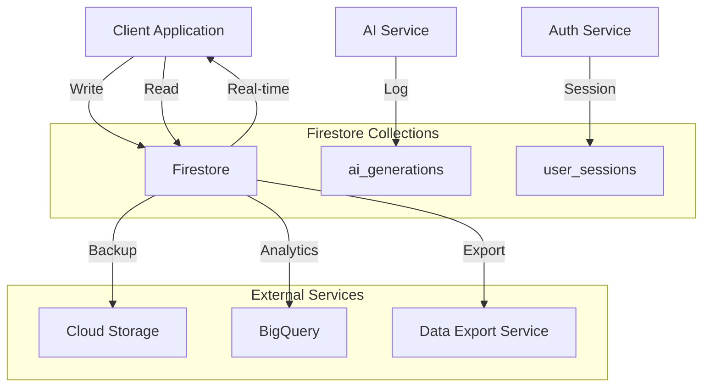
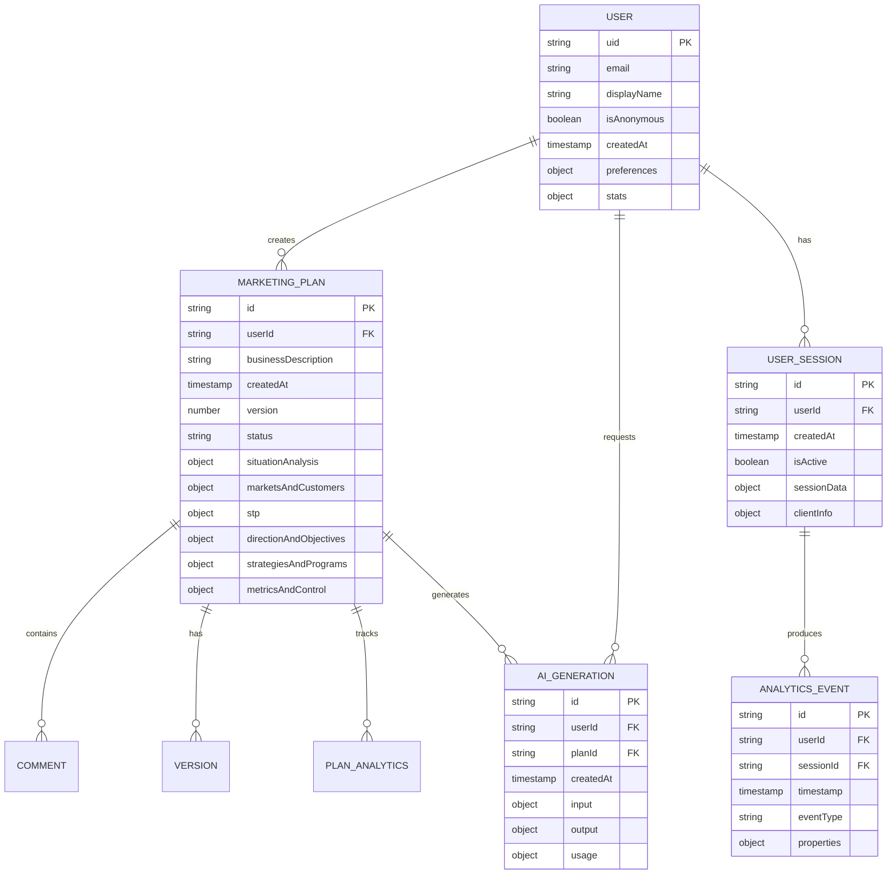

# MarketPlanAI - Database Design Document

**Version:** 1.0  
**Date:** December 2024  
**Database:** Firebase Firestore  
**Schema Version:** 1.0  

---

## Table of Contents

1. [Database Overview](#1-database-overview)
2. [Data Architecture](#2-data-architecture)
3. [Collection Schemas](#3-collection-schemas)
4. [Indexes and Performance](#4-indexes-and-performance)
5. [Security Rules](#5-security-rules)
6. [Data Relationships](#6-data-relationships)
7. [Scalability Considerations](#7-scalability-considerations)
8. [Migration Strategy](#8-migration-strategy)
9. [Backup and Recovery](#9-backup-and-recovery)
10. [Monitoring and Analytics](#10-monitoring-and-analytics)

---

## 1. Database Overview

### 1.1 Database Technology

**Primary Database:** Firebase Firestore (NoSQL Document Database)

**Key Features:**
- Real-time synchronization
- Offline support
- Automatic multi-region replication
- ACID transactions
- Built-in security rules
- Automatic scaling

### 1.2 Database Architecture

```
Firebase Firestore
├── Production Database
│   ├── users/                    # User profiles
│   ├── marketing_plans/          # Marketing plan documents
│   ├── ai_generations/          # AI generation logs
│   ├── user_sessions/           # Session management
│   ├── analytics/               # Usage analytics
│   └── system_logs/             # System operation logs
│
├── Staging Database
│   └── [Same structure as production]
│
└── Development Database
    └── [Same structure as production]
```

### 1.3 Data Classification

**Data Sensitivity Levels:**
- **Public:** App configuration, help content
- **Internal:** Usage analytics, system logs
- **Confidential:** User profiles, marketing plans
- **Restricted:** Session tokens, API keys

**Data Retention Policies:**
- **User Data:** 5 years or until account deletion
- **Anonymous Data:** 30 days of inactivity
- **Audit Logs:** 7 years for compliance
- **Analytics Data:** 2 years for business insights

---

## 2. Data Architecture

### 2.1 Collection Design Strategy

**Design Principles:**
- **Denormalization:** Optimize for read performance
- **Document Structure:** Keep related data together
- **Subcollections:** Use for one-to-many relationships
- **Reference Fields:** Use for many-to-many relationships
- **Composite Indexes:** Support complex queries

### 2.2 Data Flow Architecture



### 2.3 Document Size Optimization

**Firestore Limits:**
- Maximum document size: 1 MB
- Maximum nested depth: 20 levels
- Maximum array elements: No limit (but affects performance)
- Maximum map fields: No limit (but affects performance)

**Optimization Strategies:**
- Split large marketing plans into subcollections
- Use references for large arrays
- Implement pagination for list queries
- Cache frequently accessed data

---

## 3. Collection Schemas

### 3.1 Users Collection

**Collection Path:** `/users/{userId}`

```typescript
interface UserDocument {
  // Primary identifiers
  uid: string;                    // Firebase Auth UID
  email?: string;                 // User email (optional for anonymous)
  displayName?: string;           // User display name
  
  // Account metadata
  isAnonymous: boolean;           // Anonymous vs authenticated user
  createdAt: Timestamp;           // Account creation date
  updatedAt: Timestamp;           // Last profile update
  lastLoginAt: Timestamp;         // Last login timestamp
  lastActiveAt: Timestamp;        // Last activity timestamp
  
  // User preferences
  preferences: {
    theme?: 'light' | 'dark' | 'system';
    language?: string;            // ISO language code
    emailNotifications?: boolean;
    timezone?: string;            // IANA timezone
    autoSave?: boolean;
  };
  
  // Usage statistics
  stats: {
    plansCreated: number;         // Total plans created
    aiGenerationsUsed: number;    // Total AI generations
    lastPlanCreatedAt?: Timestamp;
    totalTimeSpent?: number;      // Milliseconds
  };
  
  // Subscription info (future)
  subscription?: {
    tier: 'free' | 'premium' | 'enterprise';
    startDate: Timestamp;
    endDate?: Timestamp;
    features: string[];
  };
  
  // Profile metadata
  profile?: {
    industry?: string;
    businessSize?: 'solo' | 'small' | 'medium' | 'large';
    role?: string;
    experience?: 'beginner' | 'intermediate' | 'expert';
  };
}
```

**Indexes:**
```javascript
// Composite indexes for users collection
[
  { fields: [{ fieldPath: 'isAnonymous' }, { fieldPath: 'lastActiveAt', order: 'desc' }] },
  { fields: [{ fieldPath: 'subscription.tier' }, { fieldPath: 'createdAt', order: 'desc' }] },
  { fields: [{ fieldPath: 'profile.industry' }, { fieldPath: 'stats.plansCreated', order: 'desc' }] }
]
```

### 3.2 Marketing Plans Collection

**Collection Path:** `/marketing_plans/{planId}`

```typescript
interface MarketingPlanDocument {
  // Primary identifiers
  id: string;                     // Auto-generated document ID
  userId: string;                 // Reference to user
  
  // Plan metadata
  title?: string;                 // User-defined plan title
  businessDescription: string;    // Core business description
  createdAt: Timestamp;          // Plan creation date
  updatedAt: Timestamp;          // Last modification date
  version: number;               // Schema version for migrations
  
  // Plan status
  status: 'draft' | 'complete' | 'archived';
  completionPercentage: number;  // 0-100
  completedSteps: number[];      // Array of completed step numbers
  
  // Plan sharing and collaboration (future)
  sharing?: {
    isPublic: boolean;
    allowedUsers: string[];       // User IDs with access
    shareToken?: string;          // Public share token
    permissions: {
      [userId: string]: 'view' | 'edit' | 'admin';
    };
  };
  
  // Step 1: Situation Analysis
  situationAnalysis?: {
    strengths: string[];
    weaknesses: string[];
    opportunities: string[];
    threats: string[];
    competitors: Array<{
      name: string;
      analysis: string;
      marketShare?: number;
      website?: string;
      strengths?: string[];
      weaknesses?: string[];
    }>;
    marketSize?: string;
    industryTrends?: string[];
  };
  
  // Step 2: Markets and Customers
  marketsAndCustomers?: {
    targetMarkets: string[];
    customerPersonas: Array<{
      name: string;
      description: string;
      demographics?: {
        ageRange?: string;
        income?: string;
        location?: string;
        education?: string;
        occupation?: string;
      };
      psychographics?: {
        values?: string[];
        interests?: string[];
        lifestyle?: string;
        painPoints?: string[];
      };
      buyingBehavior?: {
        preferredChannels?: string[];
        decisionFactors?: string[];
        budgetRange?: string;
        purchaseFrequency?: string;
      };
    }>;
    marketResearch?: {
      sources: string[];
      keyFindings: string[];
      dataPoints: Array<{
        metric: string;
        value: string;
        source: string;
      }>;
    };
  };
  
  // Step 3: STP Strategy
  stp?: {
    segmentation: string[];
    targeting: string;
    positioning: string;
    valueProposition?: string;
    competitiveAdvantage?: string;
    brandPromise?: string;
    positioningMap?: {
      xAxis: string;
      yAxis: string;
      competitors: Array<{
        name: string;
        x: number;
        y: number;
      }>;
    };
  };
  
  // Step 4: Direction and Objectives
  directionAndObjectives?: {
    missionStatement: string;
    visionStatement: string;
    coreValues?: string[];
    objectives: Array<{
      objective: string;
      kpi: string;
      target?: string;
      timeframe?: string;
      priority?: 'high' | 'medium' | 'low';
      category?: 'awareness' | 'acquisition' | 'retention' | 'revenue';
    }>;
    businessGoals?: {
      shortTerm: string[];  // 3-6 months
      mediumTerm: string[]; // 6-12 months
      longTerm: string[];   // 1+ years
    };
  };
  
  // Step 5: Strategies and Programs
  strategiesAndPrograms?: {
    marketingMix: {
      product: string[];
      price: string[];
      place: string[];
      promotion: string[];
    };
    aidaCopy: {
      attention: string;
      interest: string;
      desire: string;
      action: string;
    };
    campaigns?: Array<{
      name: string;
      objective: string;
      channels: string[];
      budget?: number;
      timeline?: {
        start: Timestamp;
        end: Timestamp;
      };
      targetAudience: string;
      keyMessages: string[];
    }>;
    budget?: {
      total?: number;
      allocation: {
        digital?: number;
        traditional?: number;
        events?: number;
        pr?: number;
        other?: number;
      };
      breakdown: Array<{
        category: string;
        amount: number;
        percentage: number;
      }>;
    };
  };
  
  // Step 6: Metrics and Control
  metricsAndControl?: {
    kpis: Array<{
      name: string;
      description?: string;
      target?: string;
      frequency?: 'daily' | 'weekly' | 'monthly' | 'quarterly';
      owner?: string;
      category?: 'awareness' | 'engagement' | 'conversion' | 'retention';
    }>;
    controlProcesses: string[];
    reviewSchedule?: {
      weekly?: string[];
      monthly?: string[];
      quarterly?: string[];
      annual?: string[];
    };
    trackingMethods?: {
      analytics: string[];
      surveys: string[];
      feedback: string[];
      financial: string[];
    };
    contingencyPlans?: Array<{
      scenario: string;
      plan: string;
      triggers: string[];
    }>;
  };
  
  // AI generation metadata
  aiGeneration?: {
    lastGeneratedAt: Timestamp;
    generationCount: number;
    modelVersion: string;
    inputHash: string;           // Hash of business description for caching
    sectionsGenerated: string[]; // Which sections were AI-generated
    customizations: string[];    // User modifications to AI content
  };
  
  // Export and sharing history
  exports?: Array<{
    exportedAt: Timestamp;
    format: 'json' | 'pdf' | 'docx' | 'txt';
    sections: string[];
    userId: string;
  }>;
  
  // Tags and categorization
  tags?: string[];
  industry?: string;
  businessStage?: 'startup' | 'growth' | 'mature' | 'pivot';
  planType?: 'comprehensive' | 'quick' | 'focused';
}
```

**Subcollections:**
```typescript
// /marketing_plans/{planId}/comments/{commentId}
interface CommentDocument {
  id: string;
  userId: string;
  content: string;
  section: string;              // Which section the comment refers to
  createdAt: Timestamp;
  updatedAt?: Timestamp;
  isResolved: boolean;
  mentions?: string[];          // User IDs mentioned in comment
}

// /marketing_plans/{planId}/versions/{versionId}
interface VersionDocument {
  id: string;
  versionNumber: number;
  createdAt: Timestamp;
  createdBy: string;
  changes: string[];            // Summary of changes
  snapshot: MarketingPlanDocument; // Full plan snapshot
}

// /marketing_plans/{planId}/analytics/{analyticsId}
interface PlanAnalyticsDocument {
  id: string;
  planId: string;
  timeSpent: number;           // Time spent on this plan (ms)
  sectionsCompleted: number[];
  aiGenerationsUsed: number;
  exports: number;
  lastActivityAt: Timestamp;
  userAgent?: string;
  ipAddress?: string;
}
```

### 3.3 AI Generations Collection

**Collection Path:** `/ai_generations/{generationId}`

```typescript
interface AIGenerationDocument {
  // Primary identifiers
  id: string;                   // Auto-generated document ID
  userId?: string;              // User ID (null for anonymous)
  planId?: string;              // Associated plan ID
  sessionId: string;            // Session identifier
  
  // Generation metadata
  createdAt: Timestamp;
  modelVersion: string;         // e.g., "gemini-2.0-flash"
  generationType: 'full_plan' | 'section_update' | 'suggestion';
  
  // Input data
  input: {
    businessDescription: string;
    inputLength: number;
    additionalContext?: string;
    sectionsRequested?: string[]; // Specific sections to generate
  };
  
  // Generation process
  processing: {
    startTime: Timestamp;
    endTime?: Timestamp;
    duration?: number;           // Milliseconds
    success: boolean;
    errorMessage?: string;
    retryCount?: number;
  };
  
  // Output data
  output?: {
    sectionsGenerated: string[];
    outputLength: number;
    quality?: {
      completeness: number;      // 0-1 score
      relevance: number;         // 0-1 score
      accuracy: number;          // 0-1 score
    };
    warnings?: string[];         // Any generation warnings
  };
  
  // Resource usage
  usage: {
    inputTokens: number;
    outputTokens: number;
    totalTokens: number;
    cost?: number;               // API cost in USD
  };
  
  // User feedback
  feedback?: {
    rating: 1 | 2 | 3 | 4 | 5;  // User satisfaction rating
    comments?: string;
    sectionsUsed: string[];      // Which sections user kept
    sectionsModified: string[];  // Which sections user changed
  };
  
  // System context
  context: {
    ipAddress?: string;
    userAgent?: string;
    clientVersion?: string;
    environment: 'production' | 'staging' | 'development';
  };
}
```

### 3.4 User Sessions Collection

**Collection Path:** `/user_sessions/{sessionId}`

```typescript
interface UserSessionDocument {
  // Session identifiers
  id: string;                   // Session ID
  userId?: string;              // User ID (null for anonymous)
  deviceId?: string;            // Device identifier
  
  // Session lifecycle
  createdAt: Timestamp;
  lastActivityAt: Timestamp;
  expiresAt: Timestamp;
  isActive: boolean;
  
  // Session data
  sessionData: {
    currentPlanId?: string;
    currentStep?: number;
    preferences?: Record<string, any>;
    temporaryData?: Record<string, any>;
  };
  
  // Device and browser info
  clientInfo: {
    userAgent: string;
    ipAddress: string;
    browser?: string;
    os?: string;
    device?: string;
    screenResolution?: string;
    timezone?: string;
  };
  
  // Activity tracking
  activity: {
    pageViews: number;
    planEdits: number;
    aiGenerations: number;
    timeSpent: number;           // Milliseconds
    lastPage?: string;
  };
  
  // Security information
  security: {
    isAnonymous: boolean;
    authMethod?: 'anonymous' | 'email' | 'google' | 'github';
    loginAttempts?: number;
    suspiciousActivity?: boolean;
    blockedAt?: Timestamp;
  };
}
```

### 3.5 Analytics Collection

**Collection Path:** `/analytics/{date}/events/{eventId}`

```typescript
interface AnalyticsEventDocument {
  // Event identifiers
  id: string;
  timestamp: Timestamp;
  userId?: string;
  sessionId: string;
  
  // Event data
  eventType: 'page_view' | 'plan_created' | 'ai_generated' | 'plan_exported' | 'user_signup' | 'error_occurred';
  eventName: string;
  
  // Event properties
  properties: {
    page?: string;
    planId?: string;
    section?: string;
    duration?: number;
    success?: boolean;
    errorType?: string;
    [key: string]: any;
  };
  
  // User context
  userContext: {
    isAnonymous: boolean;
    userTier?: string;
    planCount?: number;
    isNewUser?: boolean;
  };
  
  // Technical context
  technicalContext: {
    userAgent: string;
    ipAddress: string;
    referrer?: string;
    utm?: {
      source?: string;
      medium?: string;
      campaign?: string;
      term?: string;
      content?: string;
    };
  };
}
```

### 3.6 System Configuration Collection

**Collection Path:** `/system_config/{configId}`

```typescript
interface SystemConfigDocument {
  // Configuration metadata
  id: string;
  name: string;
  description?: string;
  version: string;
  updatedAt: Timestamp;
  updatedBy: string;
  environment: 'production' | 'staging' | 'development';
  
  // Configuration data
  config: {
    // Feature flags
    features?: {
      aiGeneration: boolean;
      userAuth: boolean;
      planSharing: boolean;
      analytics: boolean;
      [feature: string]: boolean;
    };
    
    // Rate limits
    rateLimits?: {
      aiGenerationsPerHour: number;
      apiRequestsPerMinute: number;
      planCreationsPerDay: number;
    };
    
    // AI configuration
    aiConfig?: {
      model: string;
      temperature: number;
      maxTokens: number;
      fallbackEnabled: boolean;
    };
    
    // UI configuration
    uiConfig?: {
      theme: string;
      maintenanceMode: boolean;
      announcementMessage?: string;
    };
    
    // External services
    externalServices?: {
      sentryDsn?: string;
      analyticsId?: string;
      supportEmail?: string;
    };
  };
  
  // Deployment tracking
  deployment?: {
    deployedAt: Timestamp;
    deployedBy: string;
    gitCommit?: string;
    buildNumber?: string;
  };
}
```

---

## 4. Indexes and Performance

### 4.1 Required Indexes

**Single Field Indexes (Automatic):**
- All document fields are automatically indexed
- Useful for simple equality queries

**Composite Indexes (Manual Configuration):**
```javascript
// firestore.indexes.json
{
  "indexes": [
    // User queries
    {
      "collectionGroup": "users",
      "queryScope": "COLLECTION",
      "fields": [
        { "fieldPath": "isAnonymous", "order": "ASCENDING" },
        { "fieldPath": "lastActiveAt", "order": "DESCENDING" }
      ]
    },
    
    // Marketing plan queries
    {
      "collectionGroup": "marketing_plans",
      "queryScope": "COLLECTION",
      "fields": [
        { "fieldPath": "userId", "order": "ASCENDING" },
        { "fieldPath": "status", "order": "ASCENDING" },
        { "fieldPath": "updatedAt", "order": "DESCENDING" }
      ]
    },
    {
      "collectionGroup": "marketing_plans",
      "queryScope": "COLLECTION",
      "fields": [
        { "fieldPath": "userId", "order": "ASCENDING" },
        { "fieldPath": "createdAt", "order": "DESCENDING" }
      ]
    },
    {
      "collectionGroup": "marketing_plans",
      "queryScope": "COLLECTION",
      "fields": [
        { "fieldPath": "industry", "order": "ASCENDING" },
        { "fieldPath": "completionPercentage", "order": "DESCENDING" }
      ]
    },
    
    // AI generation analytics
    {
      "collectionGroup": "ai_generations",
      "queryScope": "COLLECTION",
      "fields": [
        { "fieldPath": "userId", "order": "ASCENDING" },
        { "fieldPath": "createdAt", "order": "DESCENDING" }
      ]
    },
    {
      "collectionGroup": "ai_generations",
      "queryScope": "COLLECTION",
      "fields": [
        { "fieldPath": "processing.success", "order": "ASCENDING" },
        { "fieldPath": "createdAt", "order": "DESCENDING" }
      ]
    },
    
    // Analytics queries
    {
      "collectionGroup": "analytics",
      "queryScope": "COLLECTION_GROUP",
      "fields": [
        { "fieldPath": "eventType", "order": "ASCENDING" },
        { "fieldPath": "timestamp", "order": "DESCENDING" }
      ]
    },
    {
      "collectionGroup": "analytics",
      "queryScope": "COLLECTION_GROUP",
      "fields": [
        { "fieldPath": "userId", "order": "ASCENDING" },
        { "fieldPath": "timestamp", "order": "DESCENDING" }
      ]
    }
  ],
  
  // Array membership and range queries
  "fieldOverrides": [
    {
      "collectionGroup": "marketing_plans",
      "fieldPath": "tags",
      "indexes": [
        { "order": "ASCENDING", "queryScope": "COLLECTION" },
        { "arrayConfig": "CONTAINS", "queryScope": "COLLECTION" }
      ]
    },
    {
      "collectionGroup": "marketing_plans",
      "fieldPath": "completedSteps",
      "indexes": [
        { "arrayConfig": "CONTAINS", "queryScope": "COLLECTION" }
      ]
    }
  ]
}
```

### 4.2 Query Optimization

**Common Query Patterns:**
```typescript
// Optimized queries for common use cases
class OptimizedQueries {
  // Get user's recent plans (uses composite index)
  static getUserPlans(userId: string, limit: number = 10) {
    return db.collection('marketing_plans')
      .where('userId', '==', userId)
      .orderBy('updatedAt', 'desc')
      .limit(limit);
  }
  
  // Get plans by completion status (uses composite index)
  static getUserPlansByStatus(userId: string, status: string) {
    return db.collection('marketing_plans')
      .where('userId', '==', userId)
      .where('status', '==', status)
      .orderBy('updatedAt', 'desc');
  }
  
  // Analytics query with date range
  static getAnalyticsEvents(eventType: string, startDate: Date, endDate: Date) {
    return db.collectionGroup('events')
      .where('eventType', '==', eventType)
      .where('timestamp', '>=', startDate)
      .where('timestamp', '<=', endDate)
      .orderBy('timestamp', 'desc');
  }
  
  // AI generation statistics
  static getAIGenerationStats(userId: string, days: number = 30) {
    const cutoffDate = new Date();
    cutoffDate.setDate(cutoffDate.getDate() - days);
    
    return db.collection('ai_generations')
      .where('userId', '==', userId)
      .where('createdAt', '>=', cutoffDate)
      .orderBy('createdAt', 'desc');
  }
}
```

### 4.3 Performance Monitoring

**Query Performance Tracking:**
```typescript
class QueryPerformanceMonitor {
  static async trackQuery(queryName: string, queryFunction: () => Promise<any>) {
    const startTime = performance.now();
    
    try {
      const result = await queryFunction();
      const duration = performance.now() - startTime;
      
      await this.logQueryMetrics({
        queryName,
        duration,
        success: true,
        resultCount: result.size || result.length,
        timestamp: new Date()
      });
      
      return result;
    } catch (error) {
      const duration = performance.now() - startTime;
      
      await this.logQueryMetrics({
        queryName,
        duration,
        success: false,
        error: error.message,
        timestamp: new Date()
      });
      
      throw error;
    }
  }
  
  static async getSlowQueries(threshold: number = 1000) {
    return db.collection('query_metrics')
      .where('duration', '>', threshold)
      .orderBy('duration', 'desc')
      .limit(50)
      .get();
  }
}
```

---

## 5. Security Rules

### 5.1 Firestore Security Rules

```javascript
// firestore.rules
rules_version = '2';
service cloud.firestore {
  match /databases/{database}/documents {
    
    // Users collection - users can only access their own profile
    match /users/{userId} {
      allow read, write: if request.auth != null && request.auth.uid == userId;
      allow create: if request.auth != null && 
        request.auth.uid == userId &&
        validateUserDocument(request.resource.data);
    }
    
    // Marketing plans - private to user
    match /marketing_plans/{planId} {
      allow read, write: if request.auth != null && 
        request.auth.uid == resource.data.userId;
      allow create: if request.auth != null && 
        request.auth.uid == request.resource.data.userId &&
        validateMarketingPlan(request.resource.data);
      
      // Plan subcollections
      match /comments/{commentId} {
        allow read, write: if request.auth != null && 
          request.auth.uid == get(/databases/$(database)/documents/marketing_plans/$(planId)).data.userId;
      }
      
      match /versions/{versionId} {
        allow read: if request.auth != null && 
          request.auth.uid == get(/databases/$(database)/documents/marketing_plans/$(planId)).data.userId;
        allow create: if request.auth != null && 
          request.auth.uid == get(/databases/$(database)/documents/marketing_plans/$(planId)).data.userId;
      }
      
      match /analytics/{analyticsId} {
        allow read: if request.auth != null && 
          request.auth.uid == get(/databases/$(database)/documents/marketing_plans/$(planId)).data.userId;
        allow write: if false; // System only
      }
    }
    
    // AI generations - readable by user, writable by system
    match /ai_generations/{generationId} {
      allow read: if request.auth != null && 
        (request.auth.uid == resource.data.userId || resource.data.userId == null);
      allow write: if false; // System only
    }
    
    // User sessions - private to user
    match /user_sessions/{sessionId} {
      allow read, write: if request.auth != null && 
        request.auth.uid == resource.data.userId;
      allow create: if validateSessionData(request.resource.data);
    }
    
    // Analytics - system only
    match /analytics/{date}/events/{eventId} {
      allow read, write: if false; // System only
    }
    
    // System configuration - read-only for authenticated users
    match /system_config/{configId} {
      allow read: if request.auth != null;
      allow write: if false; // Admin only through server
    }
    
    // Helper functions
    function validateUserDocument(data) {
      return data.keys().hasAll(['uid', 'isAnonymous', 'createdAt']) &&
             data.uid is string &&
             data.isAnonymous is bool &&
             data.createdAt is timestamp;
    }
    
    function validateMarketingPlan(data) {
      return data.keys().hasAll(['userId', 'businessDescription', 'createdAt', 'version']) &&
             data.userId is string &&
             data.businessDescription is string &&
             data.businessDescription.size() >= 50 &&
             data.businessDescription.size() <= 2000 &&
             data.createdAt is timestamp &&
             data.version is number;
    }
    
    function validateSessionData(data) {
      return data.keys().hasAll(['id', 'createdAt', 'expiresAt', 'isActive']) &&
             data.id is string &&
             data.createdAt is timestamp &&
             data.expiresAt is timestamp &&
             data.isActive is bool;
    }
    
    function isAdmin() {
      return request.auth != null && 
             request.auth.token.admin == true;
    }
    
    function isSystemRequest() {
      return request.auth != null && 
             request.auth.token.system == true;
    }
  }
}
```

### 5.2 Data Validation Rules

**Server-side Validation:**
```typescript
// Comprehensive data validation
class DataValidator {
  static validateMarketingPlan(plan: Partial<MarketingPlanDocument>): ValidationResult {
    const errors: string[] = [];
    const warnings: string[] = [];
    
    // Required fields
    if (!plan.businessDescription) {
      errors.push('Business description is required');
    } else if (plan.businessDescription.length < 50) {
      errors.push('Business description must be at least 50 characters');
    } else if (plan.businessDescription.length > 2000) {
      errors.push('Business description cannot exceed 2000 characters');
    }
    
    // Validate content for potential security issues
    if (plan.businessDescription && this.containsMaliciousContent(plan.businessDescription)) {
      errors.push('Business description contains potentially harmful content');
    }
    
    // Validate data types and structure
    if (plan.situationAnalysis) {
      if (!Array.isArray(plan.situationAnalysis.strengths)) {
        errors.push('Strengths must be an array');
      }
      if (plan.situationAnalysis.strengths && plan.situationAnalysis.strengths.length > 20) {
        warnings.push('Too many strengths - consider consolidating');
      }
    }
    
    return {
      isValid: errors.length === 0,
      errors,
      warnings
    };
  }
  
  static validateUserProfile(user: Partial<UserDocument>): ValidationResult {
    const errors: string[] = [];
    
    if (!user.uid) {
      errors.push('User ID is required');
    }
    
    if (user.email && !this.isValidEmail(user.email)) {
      errors.push('Invalid email format');
    }
    
    if (user.displayName && user.displayName.length > 100) {
      errors.push('Display name too long');
    }
    
    return {
      isValid: errors.length === 0,
      errors,
      warnings: []
    };
  }
  
  private static containsMaliciousContent(text: string): boolean {
    const maliciousPatterns = [
      /<script/i,
      /javascript:/i,
      /data:/i,
      /vbscript:/i,
      /(union|select|insert|delete|update|drop)\s/i
    ];
    
    return maliciousPatterns.some(pattern => pattern.test(text));
  }
  
  private static isValidEmail(email: string): boolean {
    const emailRegex = /^[^\s@]+@[^\s@]+\.[^\s@]+$/;
    return emailRegex.test(email);
  }
}

interface ValidationResult {
  isValid: boolean;
  errors: string[];
  warnings: string[];
}
```

---

## 6. Data Relationships

### 6.1 Entity Relationship Diagram



### 6.2 Data Access Patterns

**Primary Access Patterns:**
```typescript
// 1. User Dashboard - Get user's recent plans
async function getUserDashboard(userId: string) {
  const [user, recentPlans, stats] = await Promise.all([
    db.collection('users').doc(userId).get(),
    db.collection('marketing_plans')
      .where('userId', '==', userId)
      .orderBy('updatedAt', 'desc')
      .limit(5)
      .get(),
    getUserStats(userId)
  ]);
  
  return { user: user.data(), recentPlans: recentPlans.docs.map(doc => doc.data()), stats };
}

// 2. Plan Details - Get full plan with related data
async function getPlanDetails(planId: string, userId: string) {
  const planDoc = await db.collection('marketing_plans').doc(planId).get();
  
  if (!planDoc.exists || planDoc.data()?.userId !== userId) {
    throw new Error('Plan not found or access denied');
  }
  
  const [comments, versions, analytics] = await Promise.all([
    db.collection('marketing_plans').doc(planId).collection('comments')
      .orderBy('createdAt', 'desc')
      .get(),
    db.collection('marketing_plans').doc(planId).collection('versions')
      .orderBy('versionNumber', 'desc')
      .limit(5)
      .get(),
    db.collection('marketing_plans').doc(planId).collection('analytics')
      .orderBy('lastActivityAt', 'desc')
      .limit(1)
      .get()
  ]);
  
  return {
    plan: planDoc.data(),
    comments: comments.docs.map(doc => doc.data()),
    recentVersions: versions.docs.map(doc => doc.data()),
    analytics: analytics.docs[0]?.data()
  };
}

// 3. Analytics Aggregation - Get usage statistics
async function getUsageAnalytics(timeframe: 'day' | 'week' | 'month') {
  const startDate = getStartDate(timeframe);
  
  const events = await db.collectionGroup('events')
    .where('timestamp', '>=', startDate)
    .get();
  
  return aggregateEvents(events.docs.map(doc => doc.data()));
}
```

---

## 7. Scalability Considerations

### 7.1 Horizontal Scaling

**Collection Sharding Strategy:**
```typescript
// Shard large collections by date or user hash
class CollectionSharding {
  static getShardedPath(collection: string, shardKey: string): string {
    switch (collection) {
      case 'analytics':
        // Shard by date (YYYY-MM-DD format)
        const date = new Date().toISOString().split('T')[0];
        return `analytics/${date}/events`;
        
      case 'ai_generations':
        // Shard by month for AI generations
        const monthKey = new Date().toISOString().substring(0, 7); // YYYY-MM
        return `ai_generations_${monthKey}`;
        
      case 'user_sessions':
        // Shard by user hash for better distribution
        const hash = this.hashUserId(shardKey);
        const shard = hash % 10; // 10 shards
        return `user_sessions_${shard}`;
        
      default:
        return collection;
    }
  }
  
  private static hashUserId(userId: string): number {
    let hash = 0;
    for (let i = 0; i < userId.length; i++) {
      const char = userId.charCodeAt(i);
      hash = ((hash << 5) - hash) + char;
      hash = hash & hash; // Convert to 32-bit integer
    }
    return Math.abs(hash);
  }
}
```

### 7.2 Document Size Management

**Large Document Handling:**
```typescript
// Split large marketing plans into manageable chunks
class DocumentSizeManager {
  static async saveLargeMarketingPlan(plan: MarketingPlanDocument) {
    const maxDocSize = 900000; // 900KB (leave buffer for Firestore 1MB limit)
    const planSize = this.calculateDocumentSize(plan);
    
    if (planSize <= maxDocSize) {
      // Save as single document
      return await db.collection('marketing_plans').doc(plan.id).set(plan);
    } else {
      // Split into main document and detail subcollections
      const { mainPlan, details } = this.splitPlanDocument(plan);
      
      const batch = db.batch();
      
      // Save main plan
      batch.set(db.collection('marketing_plans').doc(plan.id), mainPlan);
      
      // Save detailed sections as subcollections
      for (const [section, data] of Object.entries(details)) {
        batch.set(
          db.collection('marketing_plans').doc(plan.id).collection('details').doc(section),
          { data, updatedAt: new Date() }
        );
      }
      
      return await batch.commit();
    }
  }
  
  static async loadLargeMarketingPlan(planId: string): Promise<MarketingPlanDocument> {
    const mainPlan = await db.collection('marketing_plans').doc(planId).get();
    
    if (!mainPlan.exists) {
      throw new Error('Plan not found');
    }
    
    const planData = mainPlan.data() as MarketingPlanDocument;
    
    // Check if plan has detail subcollections
    const detailsSnapshot = await db.collection('marketing_plans')
      .doc(planId)
      .collection('details')
      .get();
    
    if (!detailsSnapshot.empty) {
      // Merge detail subcollections back into main plan
      detailsSnapshot.docs.forEach(doc => {
        const sectionName = doc.id;
        const sectionData = doc.data().data;
        (planData as any)[sectionName] = sectionData;
      });
    }
    
    return planData;
  }
}
```

### 7.3 Query Optimization for Scale

**Pagination and Limits:**
```typescript
class ScalableQueries {
  static async getPaginatedPlans(
    userId: string, 
    pageSize: number = 20, 
    lastDoc?: DocumentSnapshot
  ) {
    let query = db.collection('marketing_plans')
      .where('userId', '==', userId)
      .orderBy('updatedAt', 'desc')
      .limit(pageSize);
    
    if (lastDoc) {
      query = query.startAfter(lastDoc);
    }
    
    const snapshot = await query.get();
    
    return {
      docs: snapshot.docs.map(doc => doc.data()),
      lastDoc: snapshot.docs[snapshot.docs.length - 1],
      hasMore: snapshot.docs.length === pageSize
    };
  }
  
  static async getAnalyticsWithAggregation(
    eventType: string,
    startDate: Date,
    endDate: Date,
    aggregateBy: 'hour' | 'day' | 'week' = 'day'
  ) {
    // Use chunked queries to avoid hitting query limits
    const chunks = this.createDateChunks(startDate, endDate, aggregateBy);
    const results = [];
    
    for (const chunk of chunks) {
      const chunkData = await this.queryAnalyticsChunk(eventType, chunk.start, chunk.end);
      results.push(...chunkData);
    }
    
    return this.aggregateResults(results, aggregateBy);
  }
}
```

---

## 8. Migration Strategy

### 8.1 Schema Versioning

**Version Management:**
```typescript
interface MigrationPlan {
  fromVersion: number;
  toVersion: number;
  description: string;
  migrationFunction: (doc: any) => any;
  rollbackFunction?: (doc: any) => any;
}

class SchemaMigration {
  private static migrations: MigrationPlan[] = [
    {
      fromVersion: 1,
      toVersion: 2,
      description: 'Add industry field to marketing plans',
      migrationFunction: (plan: any) => ({
        ...plan,
        industry: plan.profile?.industry || 'general',
        version: 2
      }),
      rollbackFunction: (plan: any) => {
        const { industry, ...rest } = plan;
        return { ...rest, version: 1 };
      }
    },
    {
      fromVersion: 2,
      toVersion: 3,
      description: 'Restructure customer personas',
      migrationFunction: (plan: any) => ({
        ...plan,
        marketsAndCustomers: {
          ...plan.marketsAndCustomers,
          customerPersonas: plan.marketsAndCustomers?.customerPersonas?.map((persona: any) => ({
            name: persona.name,
            description: persona.description,
            demographics: persona.demographics || {},
            psychographics: persona.psychographics || {},
            buyingBehavior: persona.buyingBehavior || {}
          })) || []
        },
        version: 3
      })
    }
  ];
  
  static async migrateDocument(collection: string, docId: string, currentVersion: number, targetVersion: number) {
    const doc = await db.collection(collection).doc(docId).get();
    if (!doc.exists) return;
    
    let data = doc.data();
    let version = currentVersion;
    
    // Apply migrations sequentially
    while (version < targetVersion) {
      const migration = this.migrations.find(m => m.fromVersion === version);
      if (!migration) {
        throw new Error(`No migration found from version ${version}`);
      }
      
      data = migration.migrationFunction(data);
      version = migration.toVersion;
    }
    
    // Save migrated document
    await db.collection(collection).doc(docId).update(data);
    
    console.log(`Migrated ${collection}/${docId} from v${currentVersion} to v${targetVersion}`);
  }
  
  static async migrateBatch(collection: string, batchSize: number = 100) {
    const query = db.collection(collection)
      .where('version', '<', this.getCurrentVersion())
      .limit(batchSize);
    
    const snapshot = await query.get();
    
    if (snapshot.empty) {
      console.log('No documents to migrate');
      return;
    }
    
    const batch = db.batch();
    
    snapshot.docs.forEach(doc => {
      const data = doc.data();
      const currentVersion = data.version || 1;
      const targetVersion = this.getCurrentVersion();
      
      if (currentVersion < targetVersion) {
        const migratedData = this.applyMigrations(data, currentVersion, targetVersion);
        batch.update(doc.ref, migratedData);
      }
    });
    
    await batch.commit();
    console.log(`Migrated ${snapshot.docs.length} documents`);
    
    // Continue with next batch if there are more documents
    if (snapshot.docs.length === batchSize) {
      await this.migrateBatch(collection, batchSize);
    }
  }
}
```

### 8.2 Data Migration Tools

**Migration Scripts:**
```bash
#!/bin/bash
# migrate-database.sh

echo "🔄 Database Migration Script"

# Set target schema version
TARGET_VERSION=3

# Migrate users collection
echo "Migrating users collection..."
node scripts/migrate-collection.js users $TARGET_VERSION

# Migrate marketing plans collection
echo "Migrating marketing plans collection..."
node scripts/migrate-collection.js marketing_plans $TARGET_VERSION

# Validate migrations
echo "Validating migrations..."
node scripts/validate-migration.js

# Update system configuration
echo "Updating system configuration..."
firebase firestore:update system_config/schema --data '{"version": "'$TARGET_VERSION'", "updatedAt": "'$(date -u +%Y-%m-%dT%H:%M:%SZ)'"}'

echo "✅ Database migration completed"
```

---

## 9. Backup and Recovery

### 9.1 Backup Strategy

**Automated Backup Configuration:**
```typescript
// Backup configuration
const backupConfig = {
  schedule: {
    daily: {
      time: '03:00 UTC',
      collections: ['users', 'marketing_plans'],
      retention: '30 days'
    },
    weekly: {
      time: '02:00 UTC Sunday',
      collections: ['*'], // All collections
      retention: '12 weeks'
    },
    monthly: {
      time: '01:00 UTC 1st',
      collections: ['*'],
      retention: '12 months'
    }
  },
  
  destinations: {
    primary: 'gs://marketplan-ai-backups-primary',
    secondary: 'gs://marketplan-ai-backups-secondary',
    archive: 'gs://marketplan-ai-backups-archive'
  }
};

class BackupManager {
  static async createBackup(collections: string[] = ['*']) {
    const timestamp = new Date().toISOString().replace(/[:.]/g, '-');
    const backupId = `backup-${timestamp}`;
    
    try {
      // Create Firestore export
      const exportPath = `gs://marketplan-ai-backups-primary/${backupId}`;
      
      await this.exportCollections(collections, exportPath);
      
      // Verify backup integrity
      const verification = await this.verifyBackup(exportPath);
      
      // Log backup completion
      await this.logBackup({
        backupId,
        timestamp: new Date(),
        collections,
        exportPath,
        verification,
        success: true
      });
      
      return { backupId, exportPath, verification };
    } catch (error) {
      await this.logBackup({
        backupId,
        timestamp: new Date(),
        collections,
        error: error.message,
        success: false
      });
      
      throw error;
    }
  }
  
  static async restoreFromBackup(backupId: string, targetDatabase?: string) {
    const backupPath = `gs://marketplan-ai-backups-primary/${backupId}`;
    
    // Validate backup exists and is valid
    const isValid = await this.validateBackup(backupPath);
    if (!isValid) {
      throw new Error(`Backup ${backupId} is invalid or corrupted`);
    }
    
    // Create restoration point
    const restorationPoint = await this.createRestorationPoint();
    
    try {
      // Perform restoration
      await this.importFromBackup(backupPath, targetDatabase);
      
      // Verify restoration
      const verification = await this.verifyRestoration();
      
      return { restorationPoint, verification };
    } catch (error) {
      // Rollback to restoration point if restoration fails
      await this.rollbackToRestorationPoint(restorationPoint);
      throw error;
    }
  }
}
```

### 9.2 Point-in-Time Recovery

**Transaction Log Management:**
```typescript
class PointInTimeRecovery {
  static async enableContinuousBackup() {
    // Enable Firestore point-in-time recovery
    const retentionPeriod = 7 * 24 * 60 * 60 * 1000; // 7 days in milliseconds
    
    return await db.settings({
      pointInTimeRecoveryEnablement: 'ENABLED',
      pointInTimeRecoveryRetention: retentionPeriod
    });
  }
  
  static async recoverToTimestamp(targetTimestamp: Date, collections?: string[]) {
    const recoveryId = `recovery-${Date.now()}`;
    
    try {
      // Create pre-recovery backup
      const preRecoveryBackup = await BackupManager.createBackup();
      
      // Perform point-in-time recovery
      const recoveryResult = await this.performPITRecovery(targetTimestamp, collections);
      
      // Validate recovery
      const validation = await this.validateRecovery(targetTimestamp);
      
      return {
        recoveryId,
        preRecoveryBackup: preRecoveryBackup.backupId,
        recoveryResult,
        validation
      };
    } catch (error) {
      throw new Error(`Point-in-time recovery failed: ${error.message}`);
    }
  }
}
```

---

## 10. Monitoring and Analytics

### 10.1 Database Performance Monitoring

**Query Performance Tracking:**
```typescript
class DatabaseMonitoring {
  static async trackQueryPerformance() {
    const metrics = {
      slowQueries: await this.getSlowQueries(),
      indexUsage: await this.getIndexUsage(),
      documentCounts: await this.getDocumentCounts(),
      storageUsage: await this.getStorageUsage(),
      readWriteOperations: await this.getOperationCounts()
    };
    
    // Store metrics for analysis
    await db.collection('monitoring').doc('database_metrics').set({
      timestamp: new Date(),
      metrics
    });
    
    // Alert on anomalies
    await this.checkForAnomalies(metrics);
    
    return metrics;
  }
  
  static async getSlowQueries(threshold: number = 1000) {
    // Query performance monitoring collection
    return await db.collection('query_performance')
      .where('duration', '>', threshold)
      .where('timestamp', '>', new Date(Date.now() - 24 * 60 * 60 * 1000))
      .orderBy('duration', 'desc')
      .limit(50)
      .get();
  }
  
  static async analyzeQueryPatterns() {
    const patterns = await db.collection('query_performance')
      .where('timestamp', '>', new Date(Date.now() - 7 * 24 * 60 * 60 * 1000))
      .get();
    
    const analysis = {
      mostFrequentQueries: this.getMostFrequentQueries(patterns),
      slowestQueries: this.getSlowestQueries(patterns),
      queryTrends: this.getQueryTrends(patterns),
      indexRecommendations: this.getIndexRecommendations(patterns)
    };
    
    return analysis;
  }
}
```

### 10.2 Usage Analytics

**Database Usage Tracking:**
```typescript
class UsageAnalytics {
  static async collectDailyStats() {
    const today = new Date();
    const startOfDay = new Date(today.getFullYear(), today.getMonth(), today.getDate());
    
    const stats = {
      newUsers: await this.countNewUsers(startOfDay),
      activePlans: await this.countActivePlans(startOfDay),
      aiGenerations: await this.countAIGenerations(startOfDay),
      planCompletions: await this.countPlanCompletions(startOfDay),
      exports: await this.countExports(startOfDay)
    };
    
    // Store daily stats
    await db.collection('daily_stats').doc(startOfDay.toISOString().split('T')[0]).set(stats);
    
    return stats;
  }
  
  static async generateUsageReport(timeframe: 'week' | 'month' | 'quarter') {
    const endDate = new Date();
    const startDate = this.getStartDate(timeframe, endDate);
    
    const report = {
      timeframe,
      startDate,
      endDate,
      userGrowth: await this.getUserGrowthMetrics(startDate, endDate),
      planMetrics: await this.getPlanMetrics(startDate, endDate),
      aiUsage: await this.getAIUsageMetrics(startDate, endDate),
      performanceMetrics: await this.getPerformanceMetrics(startDate, endDate)
    };
    
    return report;
  }
}
```

---

## Data Governance

### Data Lifecycle Management
```typescript
class DataLifecycleManager {
  static async cleanupExpiredData() {
    const now = new Date();
    
    // Cleanup anonymous user data after 30 days of inactivity
    const anonymousUserCutoff = new Date(now.getTime() - 30 * 24 * 60 * 60 * 1000);
    await this.cleanupAnonymousUsers(anonymousUserCutoff);
    
    // Archive old marketing plans (5+ years)
    const planArchiveCutoff = new Date(now.getTime() - 5 * 365 * 24 * 60 * 60 * 1000);
    await this.archiveOldPlans(planArchiveCutoff);
    
    // Cleanup session data older than 7 days
    const sessionCutoff = new Date(now.getTime() - 7 * 24 * 60 * 60 * 1000);
    await this.cleanupExpiredSessions(sessionCutoff);
    
    // Cleanup detailed analytics older than 2 years
    const analyticsCutoff = new Date(now.getTime() - 2 * 365 * 24 * 60 * 60 * 1000);
    await this.cleanupOldAnalytics(analyticsCutoff);
  }
}
```

---

*This database design document provides a comprehensive foundation for the MarketPlanAI data layer, ensuring scalability, performance, and security while maintaining data integrity and supporting business requirements.* 